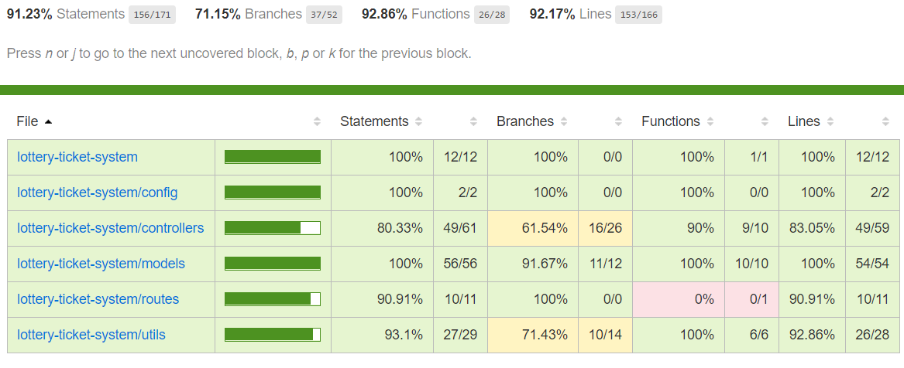

Master 

develop 

# Lottery Ticket System Web Service

This is a REST interface for a Lottery Ticket System implemented using NodeJS and ExpressJS 

## Description
There are 5 API endpoints available
 * /ticket POST Create a ticket
 * /ticket GET Return list of tickets
 * /ticket/:id GET Get individual ticket
 * /ticket/:id PUT Amend ticket lines
 * /status/:id PUT Retrieve status of ticket

## Installation

Go to the root folder and install the dependencies

```bash
npm install
```

## Usage

Start the server
```bash
npm start
```

Start the server in debug more
```bash
npm run debug
```

Run tests
```bash
npm run test
```

## Test Report
Summary

Code coverage


